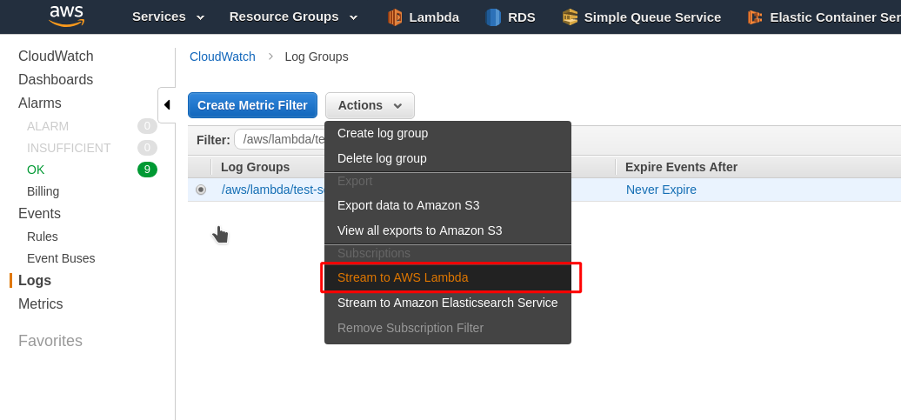

# terraform-lambda-es-logs

## Requirements

- terraform-provider-aws version >= 1.30.0

## Usage

#### About Lambda > Cloudwatch > ElasticSearch

This module creates a lambda that streams logs from Cloudwatch
to an ElasticSearch.

The created Lambda ARN is available via output variable `lambda_arn`

You can subscribe the lambda using Terraform:
https://www.terraform.io/docs/providers/aws/r/cloudwatch_log_subscription_filter.html

Using a Serverless Framework plugin:
https://github.com/amplify-education/serverless-log-forwarding

Using AWS CLI:
https://docs.aws.amazon.com/cli/latest/reference/logs/put-subscription-filter.html

On AWS Console:


#### About the log format

This module expects that you always log JSON documents, like:

```
{
    "environment": "test",
    "level": "info",
    "message": "Http request",
    "data": {
      "method": "GET",
      "path": "/health",
      "response": 200
    }
}
```
